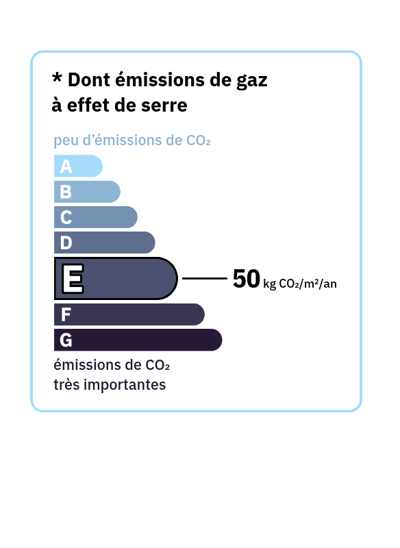

# libDPE

Ceci est une librairie PHP pour générer des diagrammes de diagnostic de
performance énergétique et climatique (DPE).

Voici quelques exemples générés via **libDPE**:

<table>
  <tr>
    <td valign="top">
      
    </td>
    <td valign="top">

    </td>
  </tr>
  <tr>
    <td valign="top">
      
    </td>
    <td valign="top">
      
    </td>
  </tr>
  <tr>
    <td valign="top">
      
    </td>
    <td valign="top">
      
    </td>
  </tr>
</table>

## Pré-requis

Imagick pour PHP doit-être installé.

Sur Debian / Ubuntu:
```
sudo apt install php-imagick
```

Sur ArchLinux:
```
sudo pacman -S php-imagick
```

Il faut également qu'il soit activé dans la configuration de PHP, veillez à ce
que la ligne suivante soit présente et non commentée dans `/etc/php/php.ini` ou
dans `/etc/php/conf.d/imagick.ini`:
```
extension = imagick
```

## Utilisation

Inclure la **libDPE**:
```php
include("libdpe.php");
```

Des exemples sont fournis:
- `example_gen.php`: exemple basique de génération d'un diagramme énergétique
  et d'un diagramme climatique.
- `example_mime.php`: exemple de retour de diagrammes directement au navigateur
  de l'utilisateur.

### Enregistrer l'image d'un diagramme de performance énergétique au format PNG

```php
function save_dpe_energ($conso, $emiss, $dpe_height, $special_zone, $image_filename)
```

**Paramètres:**
- `conso`: consommation, en kW/m²/an
- `emiss`: émissions, en kg de CO2 par m²/an
- `dpe_height`: taille d'un côté du diagramme, en pixels
- `special_zone`: zone climatique spéciale? (booléen)
- `image_filename`: chemin du fichier de destination de l'image PNG

**Retourne:** `false` en cas d'échec.

### Enregistrer l'image d'un diagramme de performance climatique au format PNG

```php
function save_dpe_ges($emiss, $dpe_height, $special_zone, $image_filename)
```

**Paramètres:**
- `emiss`: émissions, en kg de CO2 par m²/an
- `dpe_height`: taille d'un côté du diagramme, en pixels
- `special_zone`: zone climatique spéciale? (booléen)
- `image_filename`: chemin du fichier de destination de l'image PNG

**Retourne:** `false` en cas d'échec.

## Licences

La librarie est sous GNU LESSER GENERAL PUBLIC LICENSE version 3, et les
polices de caractère d'IBM sous SIL OPEN FONT LICENSE Version 1.1.

